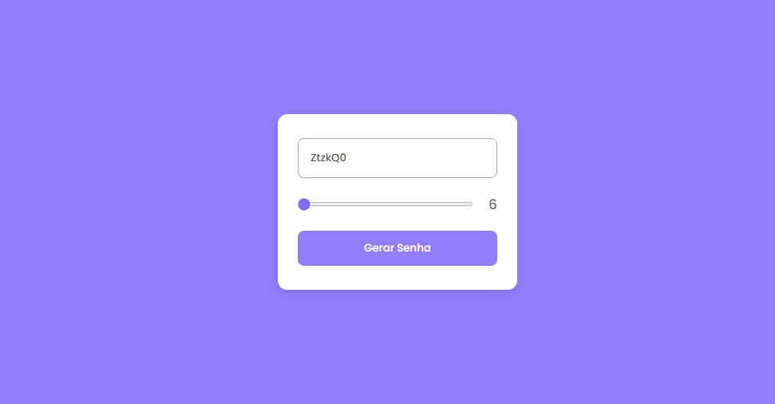

<h1 align="center">🔐 Gerador de Senha</h1>

  

---

## 🚀 Tecnologias  

Esse projeto foi desenvolvido com as seguintes tecnologias:  

- 🟦 **HTML**  
- 🎨 **CSS**  
- ⚡ **JavaScript**  
- 🌍 **Git & GitHub**  

---

## 💻 Projeto  

📌 O **Gerador de Senha** é uma aplicação simples e prática que cria senhas seguras de forma rápida.  
Ideal para aumentar a proteção de contas e dados pessoais.  

👉 [Acesse o projeto finalizado, online](https://ricantony6.github.io/gerador-de-senha/)  

---

  
  Feito com ♥ por <strong>Ricardo Antonio Rodrigues</strong>  

